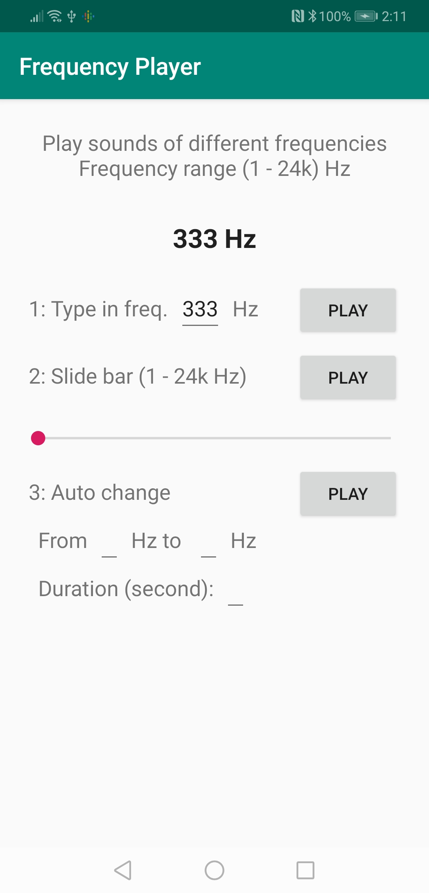

## This Android app emits sounds of user-specified frequencies

[](https://opensource.org/licenses/MIT)
&nbsp;
[](https://www.codacy.com/app/dtczhl/dtc-frequency-player?utm_source=github.com&amp;utm_medium=referral&amp;utm_content=dtczhl/dtc-frequency-player&amp;utm_campaign=Badge_Grade)



(Screenshot from Huawei Mate 20)

### Instructions
There are three ways to specify the frequency

*   type in the frequency
*   use the slide bar
*   automatically change the frequency range

### Source Code
The interface to the phone speaker is the `PlaySound` class. The supported frequency of sounds is from 1 Hz to 24k Hz.

1.  play sound
    ```java
    PlaySound mPlaySound = new PlaySound();
    mPlaySound.mOutputFreq = your_frequency;
    mPlaySound.start();
    ```
    You can change `mPlaySound.mOutputFreq` during the sound playing

2.  stop
    ```java
    if (mPlaySound != null) {
        mPlaySound.stop();
        mPlaySound = null;
    }
    ```

### Phones Tested

*   Huawei Mate 20
*   Google Pixel 2
